# บทเริ่ม

Game Engine ในบ้านเรา ที่ได้รับความนิยมสูงสุด ก็น่าจะเป็น [Unity](https://unity.com) แต่จริงๆ แล้ว ยังมี Game Engine อีกหลายตัว (มากกว่า 30 ตัว, [Game Engine List](https://en.wikipedia.org/wiki/List_of_game_engines)) ผมขอเสนอ [Godot Engine](https://godotengine.org) Game Engine ที่:

* ฟรี ต่างกับ Unity ที่พอรายได้ถึงจุดหนึ่ง ต้องเสียเงิน
* ทำได้ทั้งเกม 2D, 3D
* Export เกมออกได้ครบทุก platform ครบทั้ง Android, iOS, Web, Windowns, Linux และ Mac 

ไปที่ [Godot Engine](https://godotengine.org) แล้ว download โปรแกรมเวอร์ชั่นล่าสุดมา (ของผม version 3.5.1) เมื่อ download มาแล้ว ไม่จำเป็นต้อง install โปรแกรม เวอร์ชั่น Windows มี 2 ไฟล์ Run ได้ทันที (อีกไฟล์เป็น Batch ไฟล์ ไม่จำเป็นครับ) พอ run จะได้ตามรูปที่ 1

[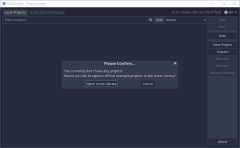](./images/normals/00/01.png)

ในที่นี้ ผมจะทำเกม ชื่อ Battle Tank ([Battle City สำหรับฝึกหัด](https://en.wikipedia.org/wiki/Battle_City)) กดปุ่ม New Project ใส่ชื่อเกม และ path ที่เก็บ source code ตามรูปที่ 2

[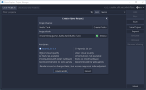](./images/normals/00/02.png)

กดปุ่ม Create & Edit จะได้ตามรูปที่ 3

[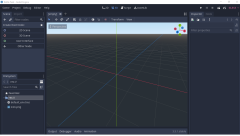](./images/normals/00/03.png)

รูปที่ 3 มีส่วนต่างๆ ดังนี้:

1. ทางซ้าย-บนสุด เป็น Main Menu มีคำสั่งเกี่ยวกับ Scene, Project, Debug, Editor, Help
2. ทางขวา-บนสุด เป็น ปุ่มสำหรับ Play, Pause, Stop
3. ทางซ้าย สร้าง 2D Scene, 3D Scene, User Interface หรือสร้างโดย Node อื่นๆ
4. ทางขวา Inspector, Node สำหรับแก้ไข property และ signals
5. ทางซ้าย-ล้าง FileSystem สามารถ ดับเบิ้ลคลิกไฟล์ที่ต้องการจะเปิดได้ทันที

กดปุ่ม User Interface ตรงแถบซ้าย-บน (จากรูปที่ 3 ส่วนที่ 3) จะได้ตามรูปที่ 4

[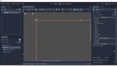](./images/normals/00/04.png)

* ตั้งชื่อ เปลี่ยนจาก Control => TitleScene (ดูรูปที่ 3 ส่วนที่ 3 มันจะเปลี่ยนไป ตามไฟล์ที่เปิดขึ้น)
* กด Ctrl+S เพื่อ save ไฟล์ ตั้งชื่อเป็น TitleScene.tscn (พยายาม save บ่อยๆ ครับ)
* แล้วกดปุ่ม Play (เหมือนกับปุ่ม play ของเครื่องเล่นเพลง)
* พอเริ่ม run ครั้งแรก จะมี dialog ถามว่า เราจะใช้ scene ที่พึ่งทำเสร็จ เป็น scene เริ่มต้นรึเปล่า ให้กด Select Current

คุณจะได้ เกมเปล่าๆ เกมหนึ่ง เป็นเกมเริ่มต้นที่คุณทำเองกับมือครับ ตามรูปที่ 5 ครับ

## เริ่มเขียนเกม

คลิกขวาที่ TitleScene แล้วเลือก Add Child Node (คลิกขวาเมนูตัวแรก) จะเปิด dialog ขึ้นมา ตามรูปที่ 6

[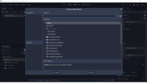](./images/normals/00/06.png)

เลือก Label และกด Create จะได้ label เพิ่มขึ้นมา ใต้ TitleScene

เปลี่ยนชื่อ label เป็น TitleLabel แล้วหันมามองทางขวาบ้าง ตรง Inspector มองหา Text property (ตัวแรกสุดครับ) แล้วใส่ค่า Battle Tank จะได้ภาพตามรูปที่ 7

[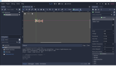](./images/normals/00/07.png)

## เปลี่ยน Font

เราได้ label ชื่อเกมมาแล้ว แต่ font ที่ให้มา เป็น font แบบธรรมดา เราจะเปลี่ยน font ให้มีสีสันสวยงามขึ้นซักหน่อย ก่อนอื่น ไปโหลด font มาก่อน เราจะใช้ font Roboto จาก https://fonts.google.com/specimen/Roboto, unzip ออกมา จากนั้น สร้าง folder fonts ขึ้นมา คลิกขวาตรง FileSystem => res:// แล้วเลือก New Folder..., พิมพ์ fonts แล้ว copy Roboto เข้ามา (หรือจะใช้ Windows Explorer ก็ได้ครับ) จะได้ตามรูปที่ 8 ด้านซ้ายล่าง

[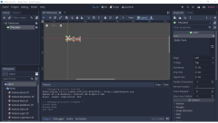](./images/normals/00/08.png)

ในที่นี้ เราจะใช้ Roboto-Black เป็น font ของ TitleLabel

* มาที่ Inspector
* ไปที่ Theme Overrides => fonts
* จะเห็นค่าเป็น [empty] อยู่ คลิกลูกศรลงที่อยู่ติดกัน จะเกิดเมนูขึ้น เลือก New DynamicFont
* คลิกที่ DynamicFont จะขึ้น Settings, Extra Spacing, Font, Resource ตรง DynamicFont
* คลิกที่ Font จะมี Font Data โผล่ขึ้นมา ค่าเริ่มต้นเป็น [empty] เช่นกัน เลือก New DynamicFontData
* คลิกที่ DynamicFontData จะขึ้น Settings ตรง DynamicFontData ขึ้นมาอีก
* คลิกที่ Font Path แล้วเลือกไฟล์ Roboto-Black.ttf
* ย้อนกลับมาที่ DynamicFont ตลิกที่ settings ให้ property มันขยายออกมา
* เปลี่ยน Size เป็น 64
* เปลี่ยน Outline Size เป็น 4
* เปลี่ยน Outline Color เป็น สีดำ
* ดูรูปที่ 9 ประกอบครับ

[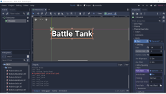](./images/normals/00/09.png)

ยังไม่จบครับ ขยับขึ้นมานิด จะเห็น Theme overrides

* เลือก Theme overrides => Colors
* เปลี่ยน Font Color ให้เป็น สีเหลือง #ffff00
* เปลี่ยนขนาด Rect => Size ให้เป็น x = 1024, y = 100
* เปลี่ยนตำแหน่ง Rect => Position ให้เป็น x = 0, y = 120
* เปลี่ยนค่า Align ให้เป็น Center
* เปลี่ยนค่า V Align ให้เป็น Center
* save และ ทดลอง run จะได้ผลตามรูปที่ 10

[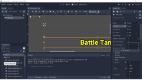](./images/normals/00/10.png)

## สร้างปุ่ม Start

* คลิกขวาที่ TitleScene เลือก Add Child Node
* จะปรากฏ dialog, เลือก Button แล้วกด Create
* rename ปุ่มที่ได้ เป็น StartButton
* ไปตรง Inspector เปลี่ยน property
* Text ใส่ค่า Start Game
* Rect => Size เปลี่ยนเป็น x = 300, y = 30
* Rect => Position เปลี่ยนเป็น x = (1024 - 300) / 2 = 362, y = 300
* เหมือนเดิม save และ ทดลอง run จะได้ผลตามรูปที่ 11

## เขียน Code

สุดท้ายสำหรับบทนี้ คือการเขียน code โดยเมื่อผู้ใช้กดปุ่ม Start Game จะเปลี่ยน scene ไปยัง scene ใหม่ ก่อนอื่น สร้าง scene ใหม่ โดย:

* คลิกที่ ปุ่ม + ต่อจาก tab TitleScene
* คลิกที่ 2D Scene แล้วเปลี่ยนชื่อ จาก Node2D เป็น BattleScene
* save

เราจะเขียน code สำหรับเปลี่ยน scene จาก TitleScne ไป BattleScene

คลิก tab TitleScene แล้วคลิกขวาที่ TitleScene แล้วเลือก Attach Script จากปรากฏ dialog ตามรูปที่ 12

[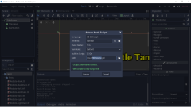](./images/normals/00/12.png)

คลิก Create, จะปรากฏไฟล์ TitleScene.gd

* กลับไปที่ design คลิกที่ปุ่ม StartButton
* ทางด้านขวา คลิก tab Node (อยู่ข้างๆ Inspector)
* จะปรากฏ signal (บางทีใช้คำว่า event, ใช้แทนกันได้ครับ)
* ดับเบิ้ลคลิก pressed() จะปรากฏ Connect a Signal to a Method
* จากนั้นกด Connect

จะได้ Code แบบนี้

	func _on_StartButton_pressed():
		pass # Replace with function body.

เขียน Code เปลี่ยน Scene เป็น

	func _on_StartButton_pressed():
		get_tree().change_scene("res://BattleScene.tscn")

run โปรแกรม จะได้ผลลัพธ์ตามรูปที่ 13

[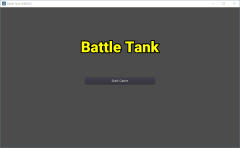](./images/normals/00/13.png)

คลิกที่ปุ่ม Start Game, จะไปต่อ BattleScene (ยังเป็น scene เปล่าอยู่) ตามรูป 14

[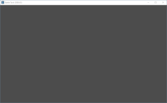](./images/normals/00/14.png)

บทหน้า สร้างฉากต่อสู่กันครับ
