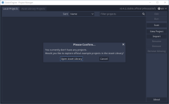
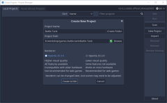
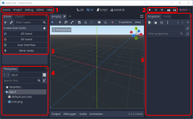
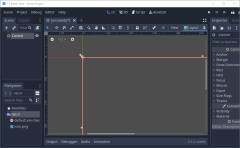
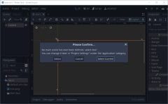
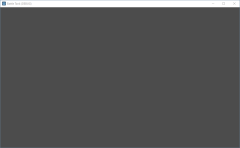

# บทเริ่ม

Game Engine ในบ้านเรา ที่ได้รับความนิยมสูงที่สุด ก็น่าจะเป็น [Unity](https://unity.com) แต่จริงๆ แล้ว ยังมี Game Engine อีกหลายตัว (มากกว่า 30 ตัว, [Game Engine List](https://en.wikipedia.org/wiki/List_of_game_engines)) ผมขอเสนอ [Godot Engine](https://godotengine.org) Game Engine ที่:

* ฟรี, ต่างกับ Unity ที่พอรายได้ถึงจุดหนึ่ง ต้องเสียเงิน
* ทำได้ทั้งเกม 2D, 3D
* Export เกมออกได้ครบทุก Platform ครบทั้ง Android, iOS, Web, Windowns, Linux และ Mac 

เริ่มต้น ไปที่ [Godot Engine](https://godotengine.org) แล้ว Download โปรแกรมเวอร์ชั่นล่าสุดมา (ล่าสุด เวอร์ชั่นของผม 3.4.2) เมื่อ Download มาแล้ว ไม่จำเป็นต้อง Install โปรแกรม เวอร์ชั่น Windows มีไฟล์เดียว Run ได้ทันที พอ Run จะได้ตามรูปที่ 1

ในที่นี้ ผมจะทำเกม ชื่อ Battle Tank ([Battle City Clone](https://en.wikipedia.org/wiki/Battle_City)) กดปุ่ม New Project ใส่ชื่อเกม และ Path ที่เก็บ Source Code ตามรูปที่ 2

กดปุ่ม Create & Edit จะได้ตามรูปที่ 3

รูปที่ 3 มีส่วนต่างๆ ดังนี้:
1. ทางซ้าย-บนสุด เป็น Main Menu มีคำสั่งเกี่ยวกับ Scene, Project, Running & Debugging, Settings, Help
2. ทางขวา-บนสุด เป็น ปุ่มสำหรับ Play, Pause, Stop
3. ทางซ้าย-บน สร้าง 2D Scene, 3D Scene, User Interface หรือสร้างโดย Node อื่นๆ
4. Inspector, Node สำหรับแก้ไข Property และ Event
5. File System สามารถ ดับเบิ้ลคลิกไฟล์ที่ต้องการจะเปิดได้ทันที

กดปุ่ม User Interface ตรงแถบซ้าย-บน (จากรูปที่ 3 ส่วนที่ 3) จะได้ตามรูปที่ 4

รูปที่ 3 มีส่วนต่างๆ ดังนี้:
* กด Ctrl+S เพื่อ Save ไฟล์ ตั้งชื่อเป็น start.tscn
* แล้วกดปุ่ม Play (เหมือนกับปุ่ม Play ของเครื่องเล่นเพลง)
* พอเริ่ม Run ครั้งแรก จะมี Dialog ถามว่า เราจะใช้ Scene ที่พึ่งทำเสร็จ เป็น Scene เริ่มต้นรึเปล่า ให้กด Select Current
* ดูตามรูปที่ 5 ประกอบครับ

คุณจะได้ เกมเปล่าๆ เกมหนึ่ง เป็นเกมเริ่มต้นที่คุณทำเองกับมือครับ ตามรูปที่ 6

