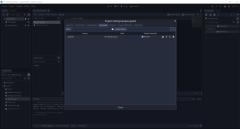
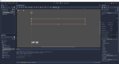
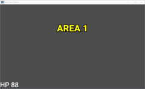

# ฉากต่อสู้

ในเกมต่อสู้ ก่อนอื่น ก็ต้องมีฉากต่อสู้กันต่อ ซึ่งเกมเราก็มีเหมือนกัน แต่ก่อนอื่น ขอแนะนำ ตัวแปร globals ก่อน

ตัวแปร globals ก็คือตัวแปรที่ใช้ได้ในทุก scene เกมของเราก็มีเหมือนกัน และตั้งชื่อว่า globals.gd คลิกขวาที่ res:// (มุมซ้ายล่าง) แล้วเลือก New Scripts... เปลี่ยน path ให้เป็น res://globals.gd จะได้ไฟล์เปล่ามันไฟล์นึง ดับเบิ้ลคลิกไฟล์ globals.gd จะเห็น template เริ่มต้น

พิมพ์ (หรือ copy) ตามนี้ครับ:

    extends Node

    # ขนาด 1 unit == 8x8 pixels
    const UNIT_WIDTH = 8
    const UNIT_HEIGHT = 8
    const UNIT_WIDTH_HALF = (UNIT_WIDTH / 2)
    const UNIT_HEIGHT_HALF = (UNIT_HEIGHT / 2)

    # ขนาดรถถัง 1 คัน == 16x16 pixels (2x2 เท่าของ unit)
    const TANK_WIDTH = 16
    const TANK_HEIGHT = 16
    const TANK_WIDTH_HALF = (TANK_WIDTH / 2)
    const TANK_HEIGHT_HALF = (TANK_HEIGHT / 2)

    # ขนาดกระสุน
    const AMMO_WIDTH = 8
    const AMMO_HEIGHT = 8
    const AMMO_WIDTH_HALF = (AMMO_WIDTH / 2)
    const AMMO_HEIGHT_HALF = (AMMO_HEIGHT / 2)

    # ขนาดฉากต่อสู้, เป็น pixels (อย่าลืม ค่าที่นี่ต้อง x4, หน่วยเป็น unit)
    const AREA_LEFT = 0
    const AREA_RIGHT = 256 # หาร 16 เพื่อเป็นตำแหน่ง max คือ 16
    const AREA_UP = 0
    const AREA_DOWN = 144 # หาร 16 เพื่อเป็นตำแหน่ง max คือ 9

    # สิ่งกีดขวางการเดิน
    enum BlockType {
        NONE = -1,
        STEEL = 0,
        BRICK = 1,
        WATER = 2,
    }

    # เสียง
    enum SoundType {
        NONE = -1,
        WALL = 0,
        BLOCK = 1,
    }

    # ทิศทาง
    enum DirectionType {
        NONE = -1,
        LEFT = 0,
        RIGHT = 1,
        UP = 2,
        DOWN = 3,
    }

    # ฝ่าย
    enum FactionType {
        NONE = -1,
        ENEMY = 0,
        HERO = 1,
    }

    # รถถังให้เลือก
    enum TankType {
        YELLOW_FAST_0   = (0 + 125),
        YELLOW_NORMAL_0 = (0 + 0),
        YELLOW_NORMAL_1 = (0 + 100),
        YELLOW_NORMAL_2 = (0 + 150),
        YELLOW_MEDIUM_0 = (0 + 25),
        YELLOW_MEDIUM_1 = (0 + 50),
        YELLOW_LARGE_0  = (0 + 75),
        YELLOW_LARGE_1  = (0 + 175),
        GREEN_FAST_0    = (0 + 325),
        GREEN_NORMAL_0  = (0 + 200),
        GREEN_NORMAL_1  = (0 + 300),
        GREEN_NORMAL_2  = (0 + 350),
        GREEN_MEDIUM_0  = (0 + 225),
        GREEN_MEDIUM_1  = (0 + 250),
        GREEN_LARGE_0   = (0 + 275),
        GREEN_LARGE_1   = (0 + 375),
        WHITE_FAST_0    = (8 + 125),
        WHITE_NORMAL_0  = (8 + 0),
        WHITE_NORMAL_1  = (8 + 100),
        WHITE_NORMAL_2  = (8 + 150),
        WHITE_MEDIUM_0  = (8 + 25),
        WHITE_MEDIUM_1  = (8 + 50),
        WHITE_LARGE_0   = (8 + 75),
        WHITE_LARGE_1   = (8 + 175),
        PURPLE_FAST_0   = (8 + 325),
        PURPLE_NORMAL_0 = (8 + 200),
        PURPLE_NORMAL_1 = (8 + 300),
        PURPLE_NORMAL_2 = (8 + 350),
        PURPLE_MEDIUM_0 = (8 + 225),
        PURPLE_MEDIUM_1 = (8 + 250),
        PURPLE_LARGE_0  = (8 + 275),
        PURPLE_LARGE_1  = (8 + 375),
    }

    # แปลงค่า pixel ไปเป็น unit
    func pixel_to_unit(pixel: Vector2) -> Vector2:
        var x = int(pixel.x / UNIT_WIDTH)
        var y = int(pixel.y / UNIT_HEIGHT)
        return Vector2(x, y)

ค่าคงที่ทั้งหมด ผมใส่ comment เอาไว้แล้วครับ

ใน Godot ไม่มีตัวแปร global จริงๆ มีแต่ AutoLoad ซึ่งใช้แทนกันได้

* คลิกเมนู (ซ้ายบน) Project => Project Settings... จะปรากฎหน้าจอ dialog ขึ้นมา คลิก tab AutoLoad
* คลิก Browse แล้วเลือกไฟล์ globals.gd โปรแกรมจะตั้งชื่อเป็น Globals จากนั้นกดปุ่ม Add
* จะได้ตามรูปที่ 1

เวลาใช้ค่าคงที่ ใช้ Globals. นำหน้าชื่อตัวแปร Globals ครับ

ไปสร้างฉากต่อสู้ต่อ เปิด BattleScene.tscn (ถ้าเปิดมา เป็นหน้าเขียน code คลิก 2D ด้านบนตรงกลางครับ) เราจะเพิ่ม บริเวณที่รถถังมายิงกัน (battle field)

* สร้าง scene เปล่าขึ้นมา
* คลิก Other Node จะปรากฏ dialog
* เลือก Area2D เป็นพื้นฐาน
* เปลี่ยนชื่อเป็น BattleField
* save ในชื่อ BattleField.tscn

กลับไปที่ BattleScene คลิกขวา แล้วเลือก Instance Child Scene จะปรากฏ dialog ออกมา มีชื่อ Scenes ที่เราสร้างไว้ 3 Scenes เลือก BattleField.tscn จะได้ BattleField ต่อเป็น Child ของ BattleScene

ต่อไป เราจะสร้าง Label เอาไว้บอกผู้เล่นว่า ขณะนี้ ฉากที่เท่าไหร่ หรือ ใครแพ้ ใครชนะ เราจะ copy Label จาก TitleScene

* เปิด TitleScene
* คลิกขวาที่ TitleLabel แล้วเลือก Copy
* กลับไปที่ BattleScene แล้วคลิกขวาที่ BattleScene => เลือก Paste
* แก้ชื่อจาก TitleLabel ไปเป็น DisplayLabel
* แก้ text ใน label ให้เป็น string ว่างไว้ก่อนครับ

เราจะสร้าง Label อีกอัน ไว้ทางมุมซ้ายล่าง เพื่อเอาไว้แสดง HP ของพระเอก

* สร้าง Label ไว้ต่อท้าย DisplayLabel ให้ชื่อ HpLabel
* Set Text ของ HpLabel ให้เป็น HP 88 เป็น placeholder ไว้ก่อน
* Set V Align ให้เป็น ให้เป็น Bottom
* เลือก Theme Overrides => Font เป็น New DynamicFont
* จะเห็นค่าเป็น [empty] อยู่ คลิกลูกศรลงที่อยู่ติดกัน จะเกิดเมนูขึ้น เลือก New DynamicFont
* คลิกที่ DynamicFont จะขึ้น Settings, Extra Spacing, Font, Resource ตรง DynamicFont
* คลิกที่ Font จะมี Font Data โผล่ขึ้นมา ค่าเริ่มต้นเป็น [empty] เช่นกัน เลือก New DynamicFontData
* คลิกที่ DynamicFontData จะขึ้น settings ตรง DynamicFontData ขึ้นมาอีก
* คลิกที่ Font Path แล้วเลือกไฟล์ Roboto-Medium.ttf
* ย้อนกลับมาที่ DynamicFont ตลิกที่ settings ให้ property มันขยายออกมา
* เปลี่ยน Size เป็น 48
* Set Rect Size ให้เป็น (200, 60)
* Set Rect Position ให้เป็น (0, 540)

จะได้ฉากต่อสู้ ตามรูปที่ 2 ครับ

จากนั้น คลิกขวาที่ BattleScene แล้วเลือก Attach Script จะปรากฏ dialog สร้าง script BattleScene.gd ขึ้นมา ใส่ code:

    extends Node2D

    # กำลังเล่น แพ้ ชนะ
    enum PlayType {
        NONE,
        START,
        PLAYING,
        LOSS,
        WIN,
        NEXT,
    }
    var play = PlayType.NONE

    # หน่วงเวลา
    var time = 0

    # รายชื่อฉาก
    var area_list = [
        "res://BattleField.tscn",
        #"res://Area1BattleField.tscn",
        #"res://Area2BattleField.tscn",
        #"res://Area3BattleField.tscn",
    ]

    # ฉากปัจจุบัน
    var area = 0

    # Called when the node enters the scene tree for the first time.
    func _ready():
        pass # Replace with function body.

    # Called every frame. 'delta' is the elapsed time since the previous frame.
    func _process(delta):
        if play == PlayType.NONE:
            # ยังไม่มีอะไร แสดงฉาก
            $DisplayLabel.visible = true
            $DisplayLabel.text = "AREA %s" % (area + 1)
            # unload BattleField ตัวเก่า
            remove_child(get_node('BattleField'))
            # สร้าง field ใหม่่จาก area_list
            var field = load(area_list[area]).instance()
            # สร้าง node ใหม่ และ add เข้าไปใน BattleScene เหมือนที่เราทำมือ
            add_child(field)
            # ขยับ field ไปอยู่ตำแหน่งแรกสุด
            move_child(field, 0)
            time = 0
            play = PlayType.START
        elif play == PlayType.START:
            # หน่วงเวลา
            time += delta
            if time >= 2:
                $DisplayLabel.visible = false
                play = PlayType.PLAYING
        elif play == PlayType.LOSS:
            # แพ้ :(
            if Input.is_action_pressed("ui_accept"):
                get_tree().change_scene("res://TitleScene.tscn")
        elif play == PlayType.WIN:
            # ชนะ :)
            if Input.is_action_pressed("ui_accept"):
                play = PlayType.NEXT
        elif play == PlayType.NEXT:
            area += 1
            if area < area_list.size():
                play = PlayType.NONE
            else:
                get_tree().change_scene("res://EndScene.tscn")

    # กำลังเล่นอยู่หรือไม่?
    func playing() -> bool:
        return play == PlayType.PLAYING

    # แจ้งสถานะ พระเอกตาย
    func loss() -> void:
        play = PlayType.LOSS
        $DisplayLabel.visible = true
        $DisplayLabel.text = "GAME OVER"

    # แจ้งสถานะ พระเอกชนะ
    func win() -> void:
        play = PlayType.WIN
        $DisplayLabel.visible = true
        $DisplayLabel.text = "YOU WIN"

รายชื่อฉาก เราจะเห็นว่า เราใส่ BattleField เอาไว้แล้ว แต่พอเราชนะ เกมก็ต้องเปลี่ยนฉาก เป็น ฉาก 2, ฉาก 3... ซึ่ง code เปลี่ยนฉาก จะอยู่ใน function _process ส่วน play == PlayType. NONE ครับ 

ส่วน code ตรงส่วน แพ้กับชนะ เอาไว้ให้ BattleField แจ้งผลมาครับ ตอนนี้ปล่อยไว้ก่อน

run code ที่ได้ตอนนี้ จะได้รูปตามรูปที่ 3 ครับ

