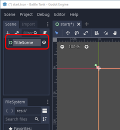
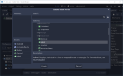
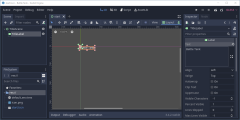
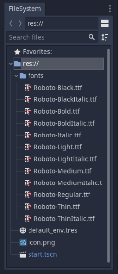
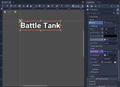
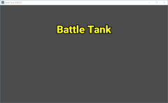
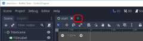
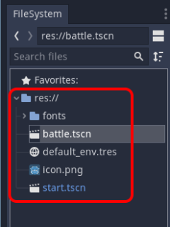
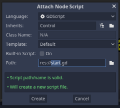
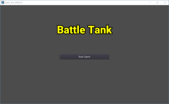

# เริ่มเขียนเกม

ในบทที่แล้ว เราได้สร้างเกมเปล่าๆ ขึ้นมาเกมนึง ซึ่งในบทนี้ เราจะมาทำต่อกันครับ

## สร้าง UI Scene

เริ่มต้นด้วยการสร้างหน้า Title ขึ้นมา เปิดไฟล์ start.tscn ขึ้นมาจากบทที่แล้ว ถ้ายังไม่ได้เปิดขึ้นมา ดับเบิ้ลคลิกที่ File System => start.tscn ก็ได้ครับ จากนั้นคลิกขวาที่ Control (ทางซ้าย-บน ตรงที่สร้าง 2D Scene, 3D Scene, User Interface) จะปรากฏเมนูขึ้น คลิก Rename หรือกด F2 พิมพ์ชื่อใหม่เป็น TitleScene จะได้ตามรูปที่ 1

คลิกขวาที่ TitleScene แล้วเลือก Add Child Node (คลิกขวาเมนูตัวแรก) จะเปิด Dialog ขึ้นมา ตามรูปที่ 2

เลือก Label และกด Create จะได้ Label เพิ่มขึ้นมา ใต้ TitleScene

เปลี่ยนชื่อ Label เป็น TitleLabel แล้วหันมามองทางขวาบ้าง ตรง Inspector มองหา Text Property (ตัวแรกสุดครับ) แล้วใส่ค่า Battle Tank จะได้ภาพตามรูปที่ 3

## เปลี่ยน Font

เราได้ Label ชื่อเกมมาแล้ว แต่ Font ที่ให้มา เป็น Font แบบธรรมดา เราจะเปลี่ยน Font ให้มีสีสันสวยงามขึ้นซักหน่อย ก่อนอื่น ไปโหลด Font มาก่อน เราจะใช้ Font Roboto จาก https://fonts.google.com/specimen/Roboto, unzip ออกมาครับ จากนั้น สร้าง Folder fonts ขึ้นมา คลิกขวาตรง File System => res:// แล้วเลือก New Folder..., พิมพ์ fonts แล้ว Copy Roboto เข้ามา (หรือจะใช้ Windows Explorer ก็ได้ครับ) จะได้ตามรูปที่ 4

ในที่นี้ เราจะใช้ Roboto-Black Font เป็น Font ของ TitleLabel

* มาที่ Inspector
* ไปที่ Theme Overrides => Fonts
* จะเห็นค่าเป็น [empty] อยู่ คลิกลูกศรลงที่อยู่ติดกัน จะเกิดเมนูขึ้น เลือก New DynamicFont
* คลิกที่ DynamicFont จะขึ้น Settings ตรง DynamicFont
* คลิกที่ Font จะมี Font Data โผล่ขึ้นมา ค่าเริ่มต้นเป็น [empty] เช่นกัน เลือก New DynamicFontData
* คลิกที่ DynamicFontData จะขึ้น Settings ตรง DynamicFontData ขึ้นมาอีก
* คลิกที่ Font Path แล้วเลือกไฟล์ Roboto-Black.ttf
* ย้อนกลับมาที่ DynamicFont ตลิกที่ Settings ให้ Property มันขยายออกมา
* เปลี่ยน Size เป็น 64
* เปลี่ยน Outline Size เป็น 4
* เปลี่ยน Outline Color เป็น สีดำ
* ดูรูปที่ 5 ประกอบครับ

ยังไม่จบครับ ขยับขึ้นมานิด จะเห็น Theme overrides

* เลือก Theme overrides => Colors
* เปลี่ยน Font Color ให้เป็น สีเหลือง #ffff00
* เปลี่ยนขนาด Rect => Size ให้เป็น x = 1024, y = 100
* เปลี่ยนตำแหน่ง Rect => Position ให้เป็น x = 0, y = 100
* เปลี่ยนค่า Align ให้เป็น Center
* เปลี่ยนค่า Valign ให้เป็น Center
* ทดลองรัน จะได้ผลตามรูปที่ 6

(หมายเหตุ: ค่าเริ่มต้นของ Screen คือ 1024 x 600 แค่เปลี่ยนได้ ใน Main Menu => Project => Project Settings => Display => Window ครับ)

## สร้างปุ่ม Start

* คลิกขวาที่ TitleScene เลือก Add Child Node
* จะปรากฏ Dialog, เลือก Button แล้วกด Create
* Rename ปุ่มที่ได้ เป็น StartButton
* ไปตรง Inspector เปลี่ยน Property
* Text ใส่ค่า Start Game
* Rect => Size เปลี่ยนเป็น x = 300, y = 30
* Rect => Position เปลี่ยนเป็น x = (1024 - 300) / 2 = 362, y = 300
* ทดลองรัน จะได้ผลตามรูปที่ 7

## เขียน Code

สุดท้ายสำหรับบทนี้ คือการเขียน Code โดยเมื่อผู้ใช้กดปุ่ม Start Game จะเปลี่ยน Scene ไปยัง Scene ใหม่ ก่อนอื่น สร้าง Scene ใหม่ โดย:

คลิกที่ ปุ่ม + ต่อจาก tab start, ดูรูป 8 ประกอบ

คลิกที่ 2D Scene แล้วกด Ctrl+S เซฟ ตั้งชื่อว่า battle.tscn และวางไฟล์นี้ไว้ ข้างๆ กับไฟล์ start.tscn ตามรูป 12

เราจะเขียน Code สำหรับเปลี่ยน Scene จาก start ไป battle

คลิก tab Start แล้วคลิกขวาที่ TitleScene แล้วเลือก Attach Script จากปรากฏ Dialog ตามรูปที่ 10

คลิก Create, จะปรากฏไฟล์ start.gd

* กลับไปที่ Design คลิกที่ปุ่ม StartButton
* ทางด้านขวา คลิก tab Node (อยู่ข้างๆ Inspector)
* จะปรากฏ Signal (บางทีใช้คำว่า Event, ใช้แทนกันได้ครับ)
* ดับเบิ้ลคลิก pressed() จะปรากฏ Connect a Signal to a Method
* จากนั้นกด Connect

จะได้ Code แบบนี้

	func _on_StartButton_pressed():
		pass # Replace with function body.

เขียน Code เปลี่ยน Scene เป็น

	func _on_StartButton_pressed():
		get_tree().change_scene("res://battle.tscn")

รันโปรแกรม จะได้ผลลัพธ์ตามรูปที่ 11

คลิกที่ปุ่ม Start Game, จะไปต่อ Battle Scene (ยังเป็น Scene เปล่าอยู่) ตามรูป 12

บทความหน้า สร้างรถถังกันครับ :)
