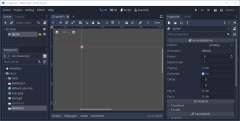
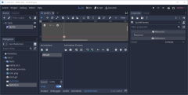
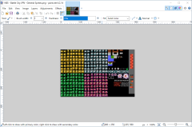
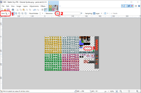
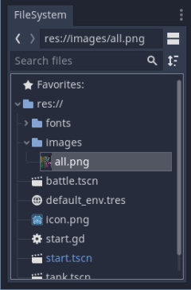
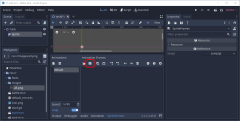
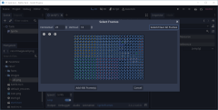
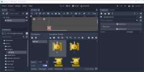
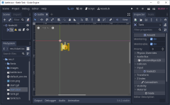

# สร้างรถถัง

ในบทความนี้ เราจะสร้างรถถังขึ้นมา 1 คัน โดยมีคุณสมบัติดังนี้:

* Animatation ด้วย Sprite
* เดินได้ 4 ทิศ ขึ้น ลง ซ้าย ขวา
* เมื่อเดินถึงขอบฉาก จะไม่สามารถเดินต่อได้

## Sprite คือ ...

Sprite (สำหรับ Computer) ก็คือ ภาพ หรือ Image นั่นแหละ เพียงแต่เวลาเรา Animate รูปเยอะๆ มันจะมี ความกว้าง, ความสูง และ ขนาด Bit Depth หรือ Color Depth เหมือนๆ กันทั้งหมด เลยทำเป็นรูปใหญ่รูปเดียว แบบนี้ครับ [Battle City Sprite](https://www.spriters-resource.com/resources/sheets/57/60016.png)

## AnimatedSprite

สร้าง Scene ใหม่ขึ้นมา เป็น Other Node แล้วเลือก Area2D จากนั้น Rename Area2D เป็น Tank และสุดท้าย เซฟในชื่อ tank.tscn จากนั้น สร้าง Node ใหม่โดยคลิกขวาที่ Tank และเลือก Add Child Node => AnimatedSprite และ Rename เป็น Sprite ตามรูปที่ 1

จากนั้นทางขวา ตรง Inspector คลิกที่ Frames (ตอนนี้ยัง [empty] อยู่) เลือก New SpriteFrames

คลิกที่ SpriteFrames จะมี Animations ปรากฏที่ด้านล่าง ตามรูปที่ 2

เราต้องหารูปรถถังมาใช้ และเราคงไม่วาดเอง (เนื่องจากฝีมือวาดรูปผมห่วย T_T) ผมหาไว้ให้แล้ว ไปที่ [Battle City Sprite](https://www.spriters-resource.com/nes/batcity/sheet/60016) และ Download มาครับ

เราต้องการฝีมือ Graphics เล็กน้อย ขอแนะนำโปรแกรม [paint.net](https://getpaint.net) เป็น Photoshop version เล็ก และฟรี Download มาและติดตั้งบนเครื่องคุณเลยครับ

เปิด paint.net ขึ้นมา จากนั้นเลือกไฟล์ Sprite ที่คุณพึ่ง Download มา จะปรากฏรูปที่ 3

1. เลือก Magic Wand
2. เลือก Tolerance เป็น 0%
3. เลือก สีดำ ในรูป
4. กด Del บน Keyboard
5. จะปรากฏตามรูปที่ 4

เซฟไฟล์ไว้ในชื่อ all.png และเอาไว้ใน Folder images ของเกม ตามรูปที่ 5

คลิก icon Add Frames from a Sprite Sheet ตามรูปที่ 6

จะปรากฏ Dialog สำหรับเลือกไฟล์ เลือกไฟล์ all.png จากนั้นกำหนด Horizontal: 25, Vertical: 16 แล้วกดปุ่ม Select/Clear All Frames จะได้รูปที่ 7

คลิก Add 400 Frame(s) จะปรากฏรูปที่ 8

คลิกที่ Sprite (ซ้าย-บน) แล้วตรง Inspector 
* เลือก Scale แล้วใส่ x = 4, y = 4 จะเห็นรูปรถถังใหญ่ขึ้น
* เลือก Centered แล้วเอาออก จะเห็นรูปรถถังเริ่มจาก (0, 0) แทนที่ (-32, -32)

คลิกขวาตรง Tank จากนั้นเลือก Attach Script จากนั้นเขียน Code

	extends Area2D

	var base_image = 0
	var sprite_left = [base_image + 2, base_image + 4]
	var sprite_right = [base_image + 6, base_image + 8]
	var sprite_up = [base_image + 0, base_image + 2]
	var sprite_down = [base_image + 4, base_image + 6]
	var sprite = sprite_up
	var velocity = Vector2(0, 0)

	# Called when the node enters the scene tree for the first time.
	func _ready():
		pass # Replace with function body.

	# Called every frame. 'delta' is the elapsed time since the previous frame.
	func _process(delta):
		# Check input 4 directions.
		if Input.is_action_pressed("ui_left"):
			velocity.x = -1
			velocity.y = 0
			sprite = sprite_left
		elif Input.is_action_pressed("ui_right"):
			velocity.x = 1
			velocity.y = 0
			sprite = sprite_right
		elif Input.is_action_pressed("ui_up"):
			velocity.x = 0
			velocity.y = -1
			sprite = sprite_up
		elif Input.is_action_pressed("ui_down"):
			velocity.x = 0
			velocity.y = 1
			sprite = sprite_down
		else:
			velocity.x = 0
			velocity.y = 0
			$Sprite.playing = false
			return

		# check boundary
		if velocity.x <= 0 && position.x <= 0:
			velocity.x = 0
			position.x = 0
		if velocity.x >= 0 && position.x >= 1024 - 64:
			velocity.x = 0
			position.x = 1024 - 64
		if velocity.y <= 0 && position.y <= 0:
			velocity.y = 0
			position.y = 0
		if velocity.y >= 0 && position.y >= 600 - 64:
			velocity.y = 0
			position.y = 600 - 64

		# If has input, move.
		if $Sprite.frame < sprite[0] || $Sprite.frame >= sprite[-1]:
			$Sprite.frame = sprite[0]
		if !$Sprite.playing:
			$Sprite.frame = sprite[0]
			$Sprite.playing = true
		translate(velocity)

	func _on_Sprite_frame_changed():
		if $Sprite.frame >= sprite[-1]:
			$Sprite.frame = sprite[0]

ตรง Function _process(delta) นั้น จะถูกเรียกเรื่อยๆ

* เราจะเช็คปุ่ม ซ้าย, ขวา, บน และ ล่าง ถ้ามี เราจะเพิ่มความเร็ว velocity จากนั้น ถ้ามีความเร็วมากกว่า 0 (velocity.length() > 0), เราจะ translate ไปตามความเร็ว
* ก่อนที่จะ translate รถถัง เราต้องเช็คก่อนว่า ติดขอบรึเปล่า

จากนั้นเปิดไฟล์ battle ขึ้นมา แล้วเลือก Instance Child Scene จะปรากฏ Dialog ใช้เลือก Scene tank จะได้ Tank โผล่ขึ้นมา

ทดลองรัน และกดปุ่ม ซ้าย, ขวา, บน และ ล่าง จะเห็นรถถังวิ่งไป :)
