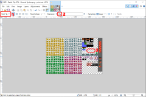

# สร้างรถถัง

ในบทความนี้ เราจะสร้างรถถังขึ้นมา โดยมีคุณสมบัติดังนี้:

* Animatation ด้วย sprite
* เดินได้ 4 ทิศ ขึ้น ลง ซ้าย ขวา
* เมื่อเดินถึงขอบฉาก จะไม่สามารถเดินต่อได้

## Sprite คือ

Sprite, สำหรับ computer, ก็คือ ภาพ หรือ image นั่นแหละ เพียงแต่เวลาเรา animate รูปเยอะๆ มันจะมี ความกว้าง, ความสูง และ ขนาด bit depth หรือ color depth เหมือนๆ กันทั้งหมด เลยทำเป็นรูปใหญ่รูปเดียว แบบนี้ครับ [Battle City Sprite](https://www.spriters-resource.com/resources/sheets/57/60016.png)

## AnimatedSprite

สร้าง scene ใหม่ขึ้นมา เป็น Other Node แล้วเลือก Area2D จากนั้น rename Area2D เป็น Tank และสุดท้าย save ในชื่อ Tank.tscn

จากนั้น สร้าง Node ใหม่โดยคลิกขวาที่ Tank และเลือก Add Child Node => AnimatedSprite และ rename เป็น Sprite ตามรูปที่ 1

จากนั้นทางขวา ตรง Inspector คลิกที่ Frames (ตอนนี้ยัง [empty] อยู่) เลือก New SpriteFrames

คลิกที่ SpriteFrames จะมี Animations กับ Animation Frames ปรากฏที่ด้านล่าง

เราต้องหารูปรถถังมาใช้ และเราคงไม่วาดเอง (เนื่องจากฝีมือวาดรูปผมห่วย T_T) ผมหาไว้ให้แล้ว ไปที่ [Battle City Sprite](https://www.spriters-resource.com/nes/batcity/sheet/60016) และ download มาครับ

เราต้องการฝีมือ graphics เล็กน้อย และถ้าคุณยังไม่มีโปรแกรมตัดต่อภาพ ขอแนะนำโปรแกรม [paint.net](https://getpaint.net) เป็นโปรแกรมที่มีขนาดเล็ก แต่ทำงานได้พอสมควร และมันฟรีครับ download มาและติดตั้งบนเครื่องคุณครับ

เปิด paint.net ขึ้นมา จากนั้นเลือกไฟล์ sprite ที่คุณพึ่ง download มา จะปรากฏรูปที่ 2

1. เลือก Magic Wand
2. เลือก Tolerance เป็น 0%
3. เลือก สีดำ ในรูป
4. กด Del บน keyboard
5. จะปรากฏตามรูปที่ 3

save ไฟล์ไว้ในชื่อ all.png และเอาไว้ใน folder images ที่สร้างใหม่ ตามรูปที่ 4

คลิก icon Add Frames from a Sprite Sheet จะปรากฏ dialog สำหรับเลือกไฟล์ เลือก all.png ที่เราเพิ่งเพิ่มเข้ามา จะปรากฏ dialog อีกหน้า กำหนด Horizontal: 25, Vertical: 16 แล้วกดปุ่ม Select/Clear All Frames สุดท้าย คลิก Add 400 Frame(s) จะได้ตามรูปที่ 5

เลือก Centered แล้วคลิกเอาออก จะเห็นรูปรถถังเริ่มจาก (0, 0) แทนที่ (-8, -8)

คลิกขวาตรง Tank จากนั้นเลือก Attach Script จากนั้นเขียน code:

    class_name Tank
    extends Area2D

    # กลุ่มรถถัง
    var TankFastGroup = [
        Globals.TankType.YELLOW_FAST_0,
        Globals.TankType.GREEN_FAST_0,
        Globals.TankType.WHITE_FAST_0,
        Globals.TankType.PURPLE_FAST_0,
    ]
    var TankNormalGroup = [
        Globals.TankType.YELLOW_NORMAL_0, Globals.TankType.YELLOW_NORMAL_1, Globals.TankType.YELLOW_NORMAL_2,
        Globals.TankType.GREEN_NORMAL_0, Globals.TankType.GREEN_NORMAL_1, Globals.TankType.GREEN_NORMAL_2,
        Globals.TankType.WHITE_NORMAL_0, Globals.TankType.WHITE_NORMAL_1, Globals.TankType.WHITE_NORMAL_2,
        Globals.TankType.PURPLE_NORMAL_0, Globals.TankType.PURPLE_NORMAL_1, Globals.TankType.PURPLE_NORMAL_2,
    ]
    var TankMediumGroup = [
        Globals.TankType.YELLOW_MEDIUM_0, Globals.TankType.YELLOW_MEDIUM_1,
        Globals.TankType.GREEN_MEDIUM_0, Globals.TankType.GREEN_MEDIUM_1,
        Globals.TankType.WHITE_MEDIUM_0, Globals.TankType.WHITE_MEDIUM_1,
        Globals.TankType.PURPLE_MEDIUM_0, Globals.TankType.PURPLE_MEDIUM_1,
    ]
    var TankLargeGroup = [
        Globals.TankType.YELLOW_LARGE_0, Globals.TankType.YELLOW_LARGE_1,
        Globals.TankType.GREEN_LARGE_0, Globals.TankType.GREEN_LARGE_1,
        Globals.TankType.WHITE_LARGE_0, Globals.TankType.WHITE_LARGE_1,
        Globals.TankType.PURPLE_LARGE_0, Globals.TankType.PURPLE_LARGE_1,
    ]

    # ค่าคงที่สำหรับขนาดรถถัง
    var size = Vector2(Globals.TANK_WIDTH, Globals.TANK_HEIGHT)

    # sprite
    var base_image = 0

    # รูปสำหรับ หันซ้าย ขวา ขึ้น ลง
    var sprite_left = [base_image + 2, base_image + 4]
    var sprite_right = [base_image + 6, base_image + 8]
    var sprite_up = [base_image + 0, base_image + 2]
    var sprite_down = [base_image + 4, base_image + 6]

    # รูปที่กำลังใช้แสดง
    var sprite = sprite_up

    # ทิศทาง
    var direction = Globals.DirectionType.UP

    # ความเร็ว
    var velocity = Vector2(0, 0)

    # กำลังเดิน
    var moving = false

    # เป้าหมายที่กำลังเดินไป, ถ้ากำลังเดิน
    var target = null

    # เวลา
    var time_used = 0
    var seconds_per_pixel = 1  # 8 pixels == 1 unit

    # คำสั่งจาก logic controller
    var controller = Globals.DirectionType.NONE

    # rate of fire, สามารถยิงอีกครั้งได้ในเวลา (วินาที)
    var rof = 1
    var last_fire_time = 0

    # ฝ่าย
    var faction = Globals.FactionType.NONE

    # เลือด
    var hp = 1

    # แผนที่
    var map

    # scene ชั้นบนสุด สำหรับถามค่า playing
    var top

    # Called when the node enters the scene tree for the first time.
    func _ready():
        map = get_parent()
        top = map.get_parent()

    # Called every frame. 'delta' is the elapsed time since the previous frame.
    func _process(delta):
        # เช็ค playing
        if !top.playing():
            return

        # จัดการ rate of fire
        if last_fire_time > 0:
            last_fire_time -= delta

        # จัดการการเดิน
        if moving:
            # ทำการปรับ animate
            $Sprite.frame = $Sprite.frame + 1
            if !($Sprite.frame >= sprite[0] && $Sprite.frame < sprite[1]):
                $Sprite.frame = sprite[0]

            # กำลังเดินไปที่ target (x, y)
            if position == target:
                moving = false
                controller = Globals.DirectionType.NONE
                #print("stoping at %s" % position)
            else:
                time_used += delta
                if time_used >= seconds_per_pixel:
                    time_used = 0
                    translate(velocity * 1)
                #print("moving at %s" % position)

        else:
            # เคลื่อนไหวตามคำสั่งชอง logic controller
            if controller == Globals.DirectionType.LEFT:
                direction = Globals.DirectionType.LEFT
                velocity.x = -1
                velocity.y = 0
                target = Vector2(position.x - Globals.UNIT_WIDTH, position.y)
                sprite = sprite_left
                if map.can_move(get_area(), Vector2(-1, 0)):
                    moving = true
            elif controller == Globals.DirectionType.RIGHT:
                direction = Globals.DirectionType.RIGHT
                velocity.x = 1
                velocity.y = 0
                target = Vector2(position.x + Globals.UNIT_WIDTH, position.y)
                sprite = sprite_right
                if map.can_move(get_area(), Vector2(1, 0)):
                    moving = true
            elif controller == Globals.DirectionType.UP:
                direction = Globals.DirectionType.UP
                velocity.x = 0
                velocity.y = -1
                target = Vector2(position.x, position.y - Globals.UNIT_HEIGHT)
                sprite = sprite_up
                if map.can_move(get_area(), Vector2(0, -1)):
                    moving = true
            elif controller == Globals.DirectionType.DOWN:
                direction = Globals.DirectionType.DOWN
                velocity.x = 0
                velocity.y = 1
                target = Vector2(position.x, position.y + Globals.UNIT_HEIGHT)
                sprite = sprite_down
                if map.can_move(get_area(), Vector2(0, 1)):
                    moving = true

            $Sprite.frame = sprite[0]
            if moving:
                time_used = 0

    # กำหนดค่าเริ่มต้นของรถถัง
    func init(tile: int) -> void:
        base_image = tile
        sprite_left = [base_image + 2, base_image + 4]
        sprite_right = [base_image + 6, base_image + 8]
        sprite_up = [base_image + 0, base_image + 2]
        sprite_down = [base_image + 4, base_image + 6]
        if tile in TankFastGroup:
            seconds_per_pixel = 0.017
            rof = 0.35
            hp = 1
        elif tile in TankNormalGroup:
            seconds_per_pixel = 0.035
            rof = 0.50
            hp = 2
        elif tile in TankMediumGroup:
            seconds_per_pixel = 0.070
            rof = 0.75
            hp = 3
        elif tile in TankLargeGroup:
            seconds_per_pixel = 0.100
            rof = 1.00
            hp = 4
        set_face(Globals.DirectionType.UP)

    # หันหน้า
    func set_face(face: int) -> void:
        direction = face
        if direction == Globals.DirectionType.LEFT:
            sprite = sprite_left
        elif direction == Globals.DirectionType.RIGHT:
            sprite = sprite_right
        elif direction == Globals.DirectionType.UP:
            sprite = sprite_up
        elif direction == Globals.DirectionType.DOWN:
            sprite = sprite_down
        $Sprite.frame = sprite[0]

    # ลบ scene นี้ออก
    func destroy() -> void:
        get_parent().remove_child(self)
        queue_free()

    # ขอพื้นที่
    func get_area() -> Rect2:
        return Rect2(position, size)

    # ถูกยิง
    func get_hit() -> bool:
        hp -= 1
        if hp <= 0:
            destroy()
            return true
        return false

    # ตัวควบคุม
    func controller(move: int) -> void:
        controller = move

    # คำสั่งยิง
    func fire() -> void:
        if last_fire_time <= 0:
            var bullet = preload("res://Bullet.tscn").instance()
            map.add_child(bullet)
            last_fire_time = rof

            var v
            var p
            if direction == Globals.DirectionType.LEFT:
                v = Vector2(-1, 0)
                p = Vector2(position.x - 1, position.y + Globals.TANK_HEIGHT_HALF)
                #print("fire left at %s" % p)
            elif direction == Globals.DirectionType.RIGHT:
                v = Vector2(1, 0)
                p = Vector2(position.x + Globals.TANK_WIDTH + 1, position.y + Globals.TANK_HEIGHT_HALF)
                #print("fire right at %s" % p)
            elif direction == Globals.DirectionType.UP:
                v = Vector2(0, -1)
                p = Vector2(position.x + Globals.TANK_WIDTH_HALF, position.y - 1)
                #print("fire up at %s" % p)
            elif direction == Globals.DirectionType.DOWN:
                v = Vector2(0, 1)
                p = Vector2(position.x + Globals.TANK_WIDTH_HALF, position.y + Globals.TANK_HEIGHT + 1)
                #print("fire down at %s" % p)
            bullet.init(direction, v, p, faction)

บรรทัดแรก class_name Tank เป็นของ GDScript เป็นการกำหนดชื่อ Class อย่าเพิ่งสับสนกับชื่อไฟล์ Tank.gd นะครับ

ส่วนประกาศตัวแปร มีตัวแปรหลายตัวทีเดียว ขอให้ดูใน Comment นะครับ

ตัวแปร map = get_parent() ก็คือ BattleField และ top = map.get_parent() ก็คือ BattleScene เอาไว้เรียกเวลาเริ่มเล่นเกม และส่งค่ากลับคืนไปเวลาแพ้หรือชนะครับ

ต่อมา ส่วน เคลื่อนไหวตามคำสั่งชอง logic controller ผมคิดแบบเหมือนปุ่มกด เวลาสั่งเดินซ้ายขวาหน้าหลัง code ค่อนข้างยาว แต่จริงๆ เป็นการแยก 4 ทิศ algorithm เหมือนเดิม เปลี่ยนแค่ parameters ครับ

ส่วน function init จะส่ง index ของรูปแรกมา โปรแกรมจะคำนวณต่อเอง

ตรงส่วนที่ยิง function fire จะมีการเรียก Bullet.tscn ให้สร้าง Bullet.tscn ขึ้นมาเปล่าๆ ก่อนครับ set node เป็น Area2D

เปิดไฟล์ BattleField.tscn ขึ้นมา แล้วคลิกขวาที่ BattleField แล้วเลือก Instance Child Scene แล้วเลือก Tank.tscn

แต่ที่คุณเห็น (ผมก็เห็น) รถถังขนาดมันเล็กเหลือใจ ไม่เป็นไรครับ คลิกที่ BattleField และ set property Transform => Scale แล้วเปลี่ยนค่า (x, y) ให้เป็น (4, 4) เท่า

ลอง run จะได้ผลตามรูปที่ 6

แน่นอน รถถังเรายังขยับไม่ได้

การที่เราจะใช้ keyboard บังคับรถถังเป็นหน้าที่ของ HeroTank ครับ ซึ่งจะ extends มาจาก Tank อีกที

พบกับบทความหน้า ตอนต่อของการสร้างรถถังครับ
