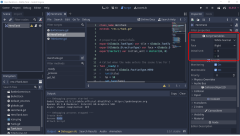
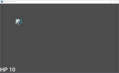

# สร้างรถถัง (ต่อ)

เราจะสร้างรถถังต่อกันนะครับ

* ไปสร้าง scene ให้คลิกที่ มุมซ้ายบน แล้วเลือก Other Node
* จะปรากฏ dialog ขึ้นมา เลือก Area2D
* rename จาก Area2D เป็น HeroTank
* save
* คลิกขวาตรง HeroTank และเลือก Attach Script
* จะได้ script HeroTank.gd

ใส่ code:

	class_name HeroTank
	extends "res://Tank.gd"

	# properties สำหรับค่าเริ่มต้น
	export(Globals.TankType) var tile = Globals.TankType.WHITE_NORMAL_0
	export(Globals.DirectionType) var face = Globals.DirectionType.RIGHT
	export(Vector2) var initial_unit = Vector2(0, 0)

	# Called when the node enters the scene tree for the first time.
	func _ready():
		faction = Globals.FactionType.HERO
		init(tile)
		hp = 10
		set_face(face)
		position = Vector2(initial_unit.x * Globals.TANK_WIDTH, initial_unit.y * Globals.TANK_HEIGHT)
		var label = map.get_parent().get_node('HpLabel')
		label.text = "HP %s" % hp

	# Called every frame. 'delta' is the elapsed time since the previous frame.
	func _process(delta):
		# เช็ค playing
		if !top.playing():
			return

		# กดปุ่มทิศทาง
		if Input.is_action_pressed("ui_left"):
			controller(Globals.DirectionType.LEFT)
		elif Input.is_action_pressed("ui_right"):
			controller(Globals.DirectionType.RIGHT)
		elif Input.is_action_pressed("ui_up"):
			controller(Globals.DirectionType.UP)
		elif Input.is_action_pressed("ui_down"):
			controller(Globals.DirectionType.DOWN)

		# กดปุ่มยิง
		if Input.is_action_pressed("ui_accept"):
			fire()

	# ถูกยิง
	func get_hit() -> bool:
		var result = .get_hit()
		var label = map.get_parent().get_node('HpLabel')
		label.text = "HP %s" % hp
		return result

ข้างบน class_name คือ HeroTank

ตรง extends เพื่อจะบอกว่า เราจะสืบทอดทุกอย่างมาจาก Tank

export(...) ที่อยู่ด้านหน้า var คือ ทำให้ตัวแปรมันออกทาง property editor ลอง click ที่ HeroTank อีกที และดูด้านขวาครับ

ก็คือ ตอนเริ่มเกม ให้เอารถถังสีขาวแบบธรรมดา หันหน้าไปทางทิศที่ต้องการ และกำหนดจุดเริ่มในแผนที่ครับ ซึ่ง (x, y) นี้ จะเป็นคน 1 หน่วย ต่อ หน่วยรถถัง

กลับไปที่ BattleField เอา Tank ออก และใส่ HeroTank เข้ามาแทน พอ run ตูม! เกิด error ขึ้น ซึงมันบอกว่า Invalid set index 'frame'...

อันนี้ ตามความเข้าใจของผมนะครับ คือ เราให้ class HeroTank มา extends ขยายจาก Tank มันจะสืบทอดทุกอย่างที่เป็น Tank ไปยัง HeroTank แต่พวก resource ไม่ตามมาด้วยครับ มันน่าจะมี function ที่จะดึง resource จาก class บรรพบุรุษ แต่ผมหาไม่เจอครับ แต่ก็เอาวิธีง่ายๆ ดีกว่าครับ

* เลือก Tank
* ลงมาด้านล่าง จะเป็น Sprite คลิกขวา แล้วเลือก Cut (เราจะไม่ instance class Tank โดยตรงครับ)
* เลือก HeroTank
* คลิกขวาที่ HeroTank แล้วเลือก Paste

เรียบร้อยครับ แต่อย่าพึ่ง run ไปที่ BattleField คลิกขวาแล้วเลือก Attach Script จะได้ BattleField.gd แล้วเพิ่ม code:

	# ตรวจสอบว่า รถถัง สามารถเคลื่อนผ่านไปได้หรือไม่?
	func can_move(place: Rect2, to: Vector2) -> bool:
		if to.x < 0:
			var to_test = place.position.x + to.x
			if to_test < Globals.AREA_LEFT:
				return false

		elif to.x > 0:
			var to_test = place.end.x + to.x
			if to_test > Globals.AREA_RIGHT:
				return false

		elif to.y < 0:
			var to_test = place.position.y + to.y
			if to_test < Globals.AREA_UP:
				return false

		elif to.y > 0:
			var to_test = place.end.y + to.y
			if to_test > Globals.AREA_DOWN:
				return false

		return true

ไว้ใน BattleField.gd ครับ

ทดลอง run อีกครั้ง จะได้ตามรูปที่ 2

อย่าพึ่งยิงกระสุนนะครับ (กด space bar) ถ้ายิง error ครับ เพราะเรายังไม่ได้ใส่ code

คราวหน้าเป็นสิ่งกีดขวางครับ
