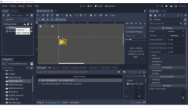
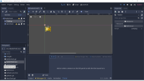
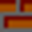
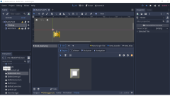
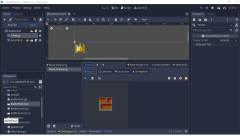
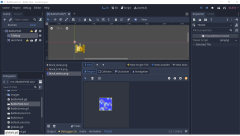
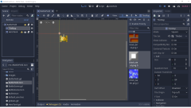
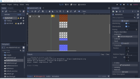
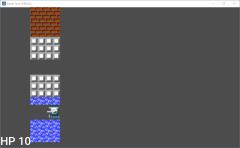

# สิ่งกีดขวาง

แน่นอน เราคงไม่สร้างรถถังสองฝ่ายแล้วยิงกันบนพื้นที่โล่งๆ เราต้องการสิ่งกีดขวาง ซึ่งสิ่งกีดขวางในเกมนี้ได้แก่:

* อิฐ ยิงให้อิฐระเบิดและผ่านไปได้
* เหล็ก ผ่านไม่ได้เลย
* แม่น้ำ ผ่านไม่ได้ แต่กระสุนข้ามได้

ที่จริงๆ ยังมี:

* ต้นไม้ ทำให้คนมองเห็นยากขึ้น
* ทะเลทราย ทำให้รถถังช้าลง
* น้ำแข็ง ทำให้ลื่น

แต่เราจะเอาแค่ อิฐ เหล็ก แม่น้ำ นะครับ

คลิกขวาที่ BattleField เลือก Add Child Node และเลือก TileMap เสร็จแล้วลาก TileMap ไปอยู๋บน HeroTank ตามรูปที่ 1

ก่อนอื่น ตรง Inspector เลือก Cell Size เป็น (8, 8)

จากนั้นขึ้นมาดู Tile Set ยังเป็น [empty] อยู่ เลือก New TileSet คลิกที่ TileSet อีกทึ จะเห็นด้านล่าง ตามรูปที่ 2

เราต้องการฝีมือการตัดรูปครับ ตัดให้ได้ 8x8 ตาม 3 รูปนี้: (ไม่ก็ copy ของผมไปใช้เลยครับ)

จากนั้นตั้งชื่อ:

* block_steel.png สำหรับ เหล็ก
* block_brick.png สำหรับ อิฐ
* block_water.png สำหรับ แม่น้ำ

สุดท้าย copy 3 รูป ไปไว้ที่ images ที่เดียวกับ all.png

* คลิกรูป + (Add Texture(s) to TileSet.) แล้วเลือก block_steel.png
* คลิก New Single Tile
* คลิกปุ่มซูม (ตรง - 1 + i) จนคุณทำงานได้
* ลากกรอบรูป ตามรูปที่ 6

การนั้นทำซ้ำกับ block_brick.png และ block_water.png ตามรูปที่ 7 และ 8

ระวัง อย่าให้เรียงผิดนะครับ เพราะเรา define ไว้ที่ globals.gd

	# สิ่งกีดขวางการเดิน
	enum BlockType {
		NONE = -1,
		STEEL = 0,
		BRICK = 1,
		WATER = 2,
	}

คลิกที่ TileMap อีกที จะเห็นตามรูป 9 (รู้สึก น่าจะเป็น bug เล็กๆ น้อยๆ เพราะ 1 เรียงก่อน 0 แต่ไม่มีปัญหาอะไรครับ)

วางรูปตามสบายครับ สำหรับผม แบบนี้ครับ เอาไว้ทดสอบ

สุดท้าย เพิ่ม code ใน BattleField.gd:

	# ตรวจสอบว่า รถถัง สามารถเคลื่อนผ่านไปได้หรือไม่?
	func can_move(place: Rect2, to: Vector2) -> bool:
		if to.x < 0:
			var to_test = place.position.x + to.x
			if to_test < Globals.AREA_LEFT:
				return false
			var unit = Globals.pixel_to_unit(Vector2(to_test, place.position.y))
			return $TileMap.get_cell(unit.x, unit.y) <= TileMap.INVALID_CELL && $TileMap.get_cell(unit.x, unit.y + 1) <= TileMap.INVALID_CELL

		elif to.x > 0:
			var to_test = place.end.x + to.x
			if to_test > Globals.AREA_RIGHT:
				return false
			var unit = Globals.pixel_to_unit(Vector2(to_test, place.position.y))
			return $TileMap.get_cell(unit.x, unit.y) <= TileMap.INVALID_CELL && $TileMap.get_cell(unit.x, unit.y + 1) <= TileMap.INVALID_CELL

		elif to.y < 0:
			var to_test = place.position.y + to.y
			if to_test < Globals.AREA_UP:
				return false
			var unit = Globals.pixel_to_unit(Vector2(place.position.x, to_test))
			return $TileMap.get_cell(unit.x, unit.y) <= TileMap.INVALID_CELL && $TileMap.get_cell(unit.x + 1, unit.y) <= TileMap.INVALID_CELL

		elif to.y > 0:
			var to_test = place.end.y + to.y
			if to_test > Globals.AREA_DOWN:
				return false
			var unit = Globals.pixel_to_unit(Vector2(place.position.x, to_test))
			return $TileMap.get_cell(unit.x, unit.y) <= TileMap.INVALID_CELL && $TileMap.get_cell(unit.x + 1, unit.y) <= TileMap.INVALID_CELL

		return true

run โปรแกรม จะได้ประมาณรูปที่ 11 ครับ

