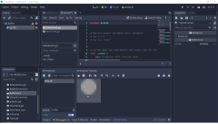
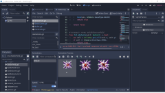
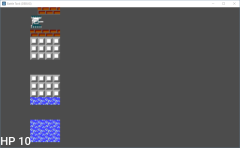

# ยิง!

บทความนี้ เป็นการยิงจากรถถังครับ

ในบทความที่ผ่านๆ มา ผมได้ให้สร้าง Bullet.tscn ไว้แล้ว แต่ยังไม่ได้ทำอะไรกับมัน เพราะงั้นวันนี้ เราจะสร้าง Bullet เพิ่ม

* เปลี่ยนชื่อจาก Area2D เป็น Bullet
* เพิ่ม AnimatedSprite ไว้ใต้ Bullet เปลี่ยนชื่อเป็น Sprite เฉยๆ
* วางรูปเป็นวงกลม ขนาด 8x8 สีเทา ตามรูป 1
* save ไว้ใน images/bullet.png
* add รูปไว้ใน SpriteFrames ตามรูปที่ 2

ไปที่ Bullet และ Attach Script จะได้ Bullet.gd มา จากนั้นเขียน code:

	extends Area2D

	# ทิศทาง
	var direction = Globals.DirectionType.UP

	# ความเร็ว
	var velocity = Vector2(0, 0)

	# ฝ่าย
	var faction = Globals.FactionType.NONE

	# แผนที่
	var map

	# Called when the node enters the scene tree for the first time.
	func _ready():
		pass

	# Called every frame. 'delta' is the elapsed time since the previous frame.
	func _process(delta):
		translate(velocity * 2)
		if map.hit_test(position, direction, faction):
			destroy()

	# กำหนดค่าเริ่มต้น จากปากกระบอกปืน
	func init(dir: int, v: Vector2, p: Vector2, fac: int) -> void:
		direction = dir
		velocity = v
		position = p
		faction = fac
		map = get_parent()

	# ลบ scene นี้ออก
	func destroy() -> void:
		get_parent().remove_child(self)
		queue_free()

ที่จริง กระสุน เมื่อยิงออกไปแล้ว มันก็ต้องพุ่งตรงไปอย่างเดียว แต่ต้องเช็คว่า มีอะไรขวางกระสุนหรือไม่

ไปเพิ่ม code ใน BattleField.gd

	# ตรวจสอบว่า กระสุน ยิงโดนอะไรหรือไม่?
	func hit_test(pos: Vector2, dir: int, fac: int) -> bool:
		var u
		var v

		# ทดสอบกำแพง
		if dir == Globals.DirectionType.LEFT:
			if pos.x < Globals.AREA_LEFT:
				boom(pos, Globals.SoundType.WALL)
				return true
			u = Globals.pixel_to_unit(Vector2(pos.x, pos.y - Globals.AMMO_HEIGHT_HALF))
			v = Globals.pixel_to_unit(Vector2(pos.x, pos.y + Globals.AMMO_HEIGHT_HALF))
		elif dir == Globals.DirectionType.RIGHT:
			if pos.x >= Globals.AREA_RIGHT:
				boom(pos, Globals.SoundType.WALL)
				return true
			u = Globals.pixel_to_unit(Vector2(pos.x, pos.y - Globals.AMMO_HEIGHT_HALF))
			v = Globals.pixel_to_unit(Vector2(pos.x, pos.y + Globals.AMMO_HEIGHT_HALF))
		elif dir == Globals.DirectionType.UP:
			if pos.y < Globals.AREA_UP:
				boom(pos, Globals.SoundType.WALL)
				return true
			u = Globals.pixel_to_unit(Vector2(pos.x - Globals.AMMO_WIDTH_HALF, pos.y))
			v = Globals.pixel_to_unit(Vector2(pos.x + Globals.AMMO_WIDTH_HALF, pos.y))
		elif dir == Globals.DirectionType.DOWN:
			if pos.y >= Globals.AREA_DOWN:
				boom(pos, Globals.SoundType.WALL)
				return true
			u = Globals.pixel_to_unit(Vector2(pos.x - Globals.AMMO_WIDTH_HALF, pos.y))
			v = Globals.pixel_to_unit(Vector2(pos.x + Globals.AMMO_WIDTH_HALF, pos.y))

		# ทดสอบสิ่งกีดขวาง
		var r0 = false
		var r1 = false
		r0 = hit_obstacle(u)
		r1 = hit_obstacle(v)
		if r0 || r1:
			boom(pos, Globals.SoundType.BLOCK)
			return true

		return false

	# ตรวจสอบว่า กระสุน ชนกับสิ่งกีดขวางหรือไม่?
	func hit_obstacle(unit: Vector2) -> bool:
		var cell = $TileMap.get_cell(unit.x, unit.y)
		if cell == Globals. BlockType. STEEL:
			return true
		elif cell == Globals. BlockType. BRICK:
			$TileMap.set_cell(unit.x, unit.y, TileMap. INVALID_CELL)
			return true

		return false

เวลาชน เนื่องจากกระสุน มันมีขนาด 8x8 แต่เอาเข้าจริงๆ ตัวมันเป็น position หรือเป็น จุดๆ เดียว เมื่อคิดจะเช็คว่า มีสิ่งกีดขวางหรือไม่ จึงต้อง span ตาม u, v และ function hit_obstacle จะเช็คว่า เป็นเหล็ก เป็นอิฐ หรือไม่

## Effect

เรายังจะเพิ่ม func boom ตาม code:

	# แสดง effect ระเบิด
	func boom(pos: Vector2, fx: int) -> void:
		var sfx = preload("res://FxBoom.tscn").instance()
		add_child(sfx)
		sfx.init(pos, fx)
		#print("boom at %s" % pos)

งานก็คือ create ตรงที่กระสุนโดนอะไรซักอย่าง

เพิ่ม FxBoom.tscn โดยมี Node2D เป็นพื้นฐาน จากนั้น:

* เปลี่ยนชื่อ Node2D เป็น FxBoom
* เพิ่ม AnimatedSprite แล้วเปลี่ยนชื่อเป็น Sprite
* เพิ่ม New SpriteFrames
* โชว์ฝีมือการตัดรูปอีกครั้ง โดยตัดรูประเบิด 3 รูปติดกัน ตามรูปที่ 3
* save รูปไว้ที่เดิม images/boom.png
* คลิก Add Frames from a Sprite Sheet
* เลือกรูป boom.png ที่พึ่งตัดมา
* กำหนด Horizontal: 3 และ Vertical: 1 และคลิก Select/Clear All Frames
* สุดท้าย คลิก Add 3 Frame(s) ตามรูปที่ 4

เพิ่มเสียงให้ FxBoom โดย

* เพิ่ม AudioStreamPlayer แล้ว rename เป็น WallAudio
* เพิ่ม AudioStreamPlayer อีกตัว แล้ว rename เป็น BlockAudio

จากนั้นก็หาเสียง จาก [Battle City Sounds](https://www.sounds-resource.com/nes/battlecity/sound/3710/) unzip ออกมา ลองฟังเสียงแล้วเลือกดู ผมเลือกได้ Battle City SFX (6).wav สำหรับเสียงชนกำแพง และ Battle City SFX (7).wav สำหรับเสียงสิ่งกีดขวาง rename ไฟล์เป็น wall.wav และ boom.wav ตามลำดับ และ move ไฟล์ทั้งสองเอาไว้ที่ sounds

* สำหรับ WallAudio ตรง Stream คลิกตรงที่ ลง แล้วเลือก Load => เลือกไฟล์ sounds/wall.wav
ููึ* สำหรับ BlockAudio ตรง Stream คลิกตรงที่ ลง แล้วเลือก Load => เลือกไฟล์ sounds/boom.wav

จากนั้นเขียน code ให้กับ FxBoom คลิกขวาแล้วเลือก Attach Script จะได้ไฟล์ FxBoom.gd

* เลือก Sprite และไปที่ Node => Signals (ทางขวาบน)
* ดับเบิ้ลคลิก ตรง animation_finished()
* จะขึ้น dialog มา กดปุ่ม Connect

code ทั้งหมดของ FxBoom

	extends Node2D

	# จำนวนรอบ สำหรับทำ animate
	var max_loop = 2
	var loop = 0

	# Called when the node enters the scene tree for the first time.
	func _ready():
		pass # Replace with function body.

	# Called every frame. 'delta' is the elapsed time since the previous frame.
	#func _process(delta):
	#	pass

	# ถูกเรียกเมื่อ AnimatedSprite เล่นจบ animate
	func _on_Sprite_animation_finished():
		loop = loop + 1
		if loop < max_loop:
			$Sprite.frame = 0
		else:
			destroy()

	# กำหนดค่าเริ่มต้น สำหรับ effect ระเบิด
	func init(pos: Vector2, fx: int) -> void:
		position = pos
		$Sprite.playing = true
		if fx == Globals.SoundType.WALL:
			$WallAudio.playing = true
		elif fx == Globals.SoundType.BLOCK:
			$BlockAudio.playing = true

	# ลบ scene นี้ออก
	func destroy() -> void:
		get_parent().remove_child(self)
		queue_free()

ลอง run ดูครับ ถ้าไม่ผิดพลาดอะไร น่าจะได้ประมาณรูปที่ 5 ครับ

