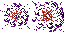
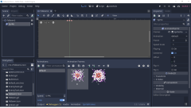

# ยิง!!

ในบทนี้ จะเป็นการเช็คการยิงกัน ก่อนอื่น ไปที่ BattleField แล้วเพิ่ม code

ก่อนอื่น ตรงต้นไพล์ เพิ่ม

	# เก็บค่า parent ไว้ เพื่อการ access บ่อยๆ
	var parent

	# Called when the node enters the scene tree for the first time.
	func _ready():
		parent = get_parent()

จากนั้นตรงกลาง เพิ่ม function hit_test ไว้เช็ครถถัง ที่ไม่ใช่ฝ่ายเดียวกัน

	# ตรวจสอบว่า กระสุน ยิงโดนอะไรหรือไม่?
	func hit_test(pos: Vector2, dir: int, fac: int) -> bool:
		var u
		var v

		# ทดสอบกำแพง
		if dir == Globals.DirectionType.LEFT:
			if pos.x < Globals.AREA_LEFT:
				boom(pos, Globals.SoundType.WALL)
				return true
			u = Globals.pixel_to_unit(Vector2(pos.x, pos.y - Globals.AMMO_HEIGHT_HALF))
			v = Globals.pixel_to_unit(Vector2(pos.x, pos.y + Globals.AMMO_HEIGHT_HALF))
		elif dir == Globals.DirectionType.RIGHT:
			if pos.x >= Globals.AREA_RIGHT:
				boom(pos, Globals.SoundType.WALL)
				return true
			u = Globals.pixel_to_unit(Vector2(pos.x, pos.y - Globals.AMMO_HEIGHT_HALF))
			v = Globals.pixel_to_unit(Vector2(pos.x, pos.y + Globals.AMMO_HEIGHT_HALF))
		elif dir == Globals.DirectionType.UP:
			if pos.y < Globals.AREA_UP:
				boom(pos, Globals.SoundType.WALL)
				return true
			u = Globals.pixel_to_unit(Vector2(pos.x - Globals.AMMO_WIDTH_HALF, pos.y))
			v = Globals.pixel_to_unit(Vector2(pos.x + Globals.AMMO_WIDTH_HALF, pos.y))
		elif dir == Globals.DirectionType.DOWN:
			if pos.y >= Globals.AREA_DOWN:
				boom(pos, Globals.SoundType.WALL)
				return true
			u = Globals.pixel_to_unit(Vector2(pos.x - Globals.AMMO_WIDTH_HALF, pos.y))
			v = Globals.pixel_to_unit(Vector2(pos.x + Globals.AMMO_WIDTH_HALF, pos.y))

		# ทดสอบสิ่งกีดขวาง
		var r0 = false
		var r1 = false
		r0 = hit_obstacle(u)
		r1 = hit_obstacle(v)
		if r0 || r1:
			boom(pos, Globals.SoundType.BLOCK)
			return true

		# ทดสอบรถถัง ที่ไม่ใช่ฝ่ายเดียวกัน
		var rect = Rect2(pos.x - Globals.AMMO_WIDTH_HALF, pos.y - Globals.AMMO_HEIGHT_HALF, Globals.AMMO_WIDTH, Globals.AMMO_HEIGHT)
		if fac == Globals.FactionType.ENEMY:
			# กระสุนฝ่ายศัตรู
			var tank = $HeroTank
			if tank != null && hit_tank(tank, rect):
				# ยิงโดน
				boom(pos, Globals.SoundType.BLOCK)
				if tank.get_hit():
					# พระเอกตาย T_T
					boom2(pos)
					parent.loss()
				return true
		elif fac == Globals.FactionType.HERO:
			# กระสุนพระเอก
			var count = get_child_count()
			var i = 0
			while i < count:
				var tank = get_child(i) as EnemyTank
				if tank != null && hit_tank(tank, rect):
					# ยิงโดน
					boom(pos, Globals.SoundType.BLOCK)
					if tank.get_hit():
						# ศัตรูตาย
						boom2(pos)
						# ศัตรูตายหมดแล้วหรือไม่?
						if check_winning():
							parent.win()
					return true
				i += 1

		return false

และเพิ่ม

	# ตรวจสอบว่า กระสุนโดนรถถัง
	func hit_tank(tank: Tank, rect: Rect2) -> bool:
		var a = tank.get_area()
		return a.intersects(rect)

	# ตรวจสอบว่า พระเอกชนะหรือยัง?
	func check_winning() -> bool:
		var count = get_child_count()
		var i = 0
		while i < count:
			var tank = get_child(i) as EnemyTank
			if tank != null:
				return false
			i += 1
		return true

และสุดท้ายเพิ่ม

	# แสดง effect ระเบิดใหญ่
	func boom2(pos: Vector2) -> void:
		var sfx = preload("res://FxBoom2.tscn").instance()
		add_child(sfx)
		sfx.init(pos)
		#print("boom2 at %s" % pos)

## Effect 2

จากที่ผ่านมา ทำ FxBoom2.tscn เป็นระเบิดขนาดใหญ่ ไว้เวลารถถังระเบิด

* สร้าง FxBoom.tscn โดยมี Node2D เป็นพื้นฐาน
* เปลี่ยนชื่อ Node2D เป็น FxBoom2
* save
* เพิ่ม AnimatedSprite แล้วเปลี่ยนชื่อเป็น Sprite
* เพิ่ม New SpriteFrames
* แสดงฝีมือการตัดรูปอีกครั้ง ครั้งสุดท้ายแล้ว โดยตัดรูประเบิด 2 รูปติดกัน ตามรูปที่ 1
* save รูปไว้ที่เดิม images/boom2.png
* คลิก Add Frames from a Sprite Sheet
* เลือกรูป boom2.png ที่พึ่งตัดมา
* กำหนด Horizontal: 2 และ Vertical: 1 และคลิก Select/Clear All Frames
* สุดท้าย คลิก Add 2 Frame(s) ตามรูปที่ 2

เพิ่มเสียงให้ FxBoom2 โดยเพิ่ม AudioStreamPlayer แล้ว rename เป็น BombAudio

จากนั้นหาเสียง (อีกแล้ว) โดยใช้ไฟล์ Battle City SFX (11).wav เปลี่ยนชื่อเป็น boom2.wav move ไฟล์ boom2.wav ไปไว้ที่ sounds 

เลือก BombAudio ตรง Stream คลิกตรงที่ ลง แล้วเลือก Load => เลือกไฟล์ sounds/boom2.wav

เพิ่ม code โดย คลิกขวาที่ FxBoom2 และเลือก Attach Script จะได้ไฟล์ FxBoom2.gd

code:

	extends Node2D

	# จำนวนรอบ สำหรับทำ animate
	var max_loop = 4
	var loop = 0

	# Called when the node enters the scene tree for the first time.
	func _ready():
		pass # Replace with function body.

	# Called every frame. 'delta' is the elapsed time since the previous frame.
	#func _process(delta):
	#	pass

	# ถูกเรียกเมื่อ AnimatedSprite เล่นจบ animate
	func _on_Sprite_animation_finished():
		loop = loop + 1
		if loop < max_loop:
			$Sprite.frame = 0
		else:
			destroy()

	# กำหนดค่าเริ่มต้น สำหรับ effect ระเบิด
	func init(pos: Vector2) -> void:
		position = pos
		$Sprite.playing = true
		$BombAudio.playing = true

	# ลบ scene นี้ออก
	func destroy() -> void:
		get_parent().remove_child(self)
		queue_free()

อย่าลืม connect signals กับ code เหมือนเดิม ไม่งั้น animate จะไม่ถูกรับรู้

* เลือก Sprite และไปที่ Node => Signals (ทางขวาบน)
* ดับเบิ้ลคลิก ตรง animation_finished()
* จะขึ้น dialog มา กดปุ่ม Connect

ลอง run ดูครับ ใกล้จะเสร็จแล้ว ^_^
