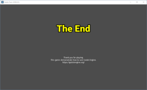

# ฉากจบ

เป็นฉากที่สั้นมากครับ :)

สร้าง User Interface scene และเปลี่ยนชื่อ Control => EndScene แล้ว save

copy DisplayLabel จาก BattleScene จากนั้น คลิกขวาตรง EndScene และเลือก Paste คลิกที่ DisplayLabel ตรง text พิมพ์ The End

เพิ่ม label อีกอันหนึ่ง ใช้ชื่อ ThankLabel และ set property

* Align และ V Align = Center
* Rect Size = (624, 80)
* Rect Position = (200, 360)

Text พิมพ์:

Thank you for playing.
This game demonstrate how to use Godot Engine.
https://godotengine.org/

เล่นเกมแล้วจบดู จะเห็นรูปที่ 1

