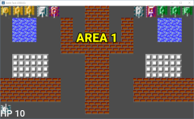
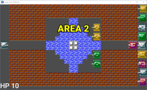
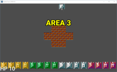
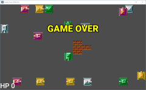

# เอาทุกอย่างมารวมกัน

เกม Battle Tank ก็จบ flow แล้ว แต่ยังไง เราก็น่าจะทำฉากให้ดีขึ้น ไม่ใช่ฉากทดสอบเกม

ก่อนอื่น ไปที่ BattleField แล้วคลิกเลือก TileMap

* ตรง Tile Set คลิกลง เพื่อเปิดเมนูย่อย
* เลือก Save โปรแกรมจะเปิด dialog
* พิมพ์ map.tres

ต่อไป เวลาต้องการ Tile Set เข้ามาใช้ไฟล์ map.tres ได้เลยครับ

## Area 1

สร้าง scene ใหม่ โดยใช้ Area2D เป็นพื้นฐาน จากนั่นเปลี่ยนชื่อจาก Area2D => BattleField (ชื่อซ้ำ เพราะมันจะถูกโหลดเมื่อถึงเวลา) save แล้วพิมพ์ชือ Area1BattleField.tscn แทน

ตรง Transform อย่าลืม set Scale เป็น (4, 4) เท่า

Attach Script แล้วเลือกไฟล์ BattleField.gd ไฟล์เดิม ไม่ต้องแก้อะไร

วาง TileMap และเลือก Tile Set เป็น Load ไฟล์ เลือกไฟล์ map.tres ที่เราเพิ่งสร้าง

วาง HeroTank 1 คัน set property ให้เรียบร้อย

วาง EnemyTank อย่างน้อย 1 คัน set property ให้เรียบร้อย

สุดท้าย แก้ไขตรง code ของ BattleScene:

	# รายชื่อฉาก
	var area_list = [
		#"res://BattleField.tscn",
		"res://Area1BattleField.tscn",
		#"res://Area2BattleField.tscn",
		#"res://Area3BattleField.tscn",
	]

run ทดสอบ

ของผมได้แบบนี้ (รูปที่ 1)

## Area 2 และ 3

ใช้วิธีเดียวกัน ผมทำ Area 2, 3 ได้ตามรูปที่ 2, 3

และรูปสุดท้าย Game Over ครับ กด space bar เพื่อเริ่มเล่นใหม่ครับ

## สุดท้าย

Godot Engine เป็น engine ที่ไม่ยากอะไรนัก script ง่าย และผู้ผลิตเตรียมทั้ง library และ UI มาให้อย่างพร้อมเพียง

หวังว่าคุณได้รับประโยชน์อะไรเล็กๆ น้อยๆ จากบทความนี้ โอกาสหน้าพบกันใหม่ครับ ^_^
